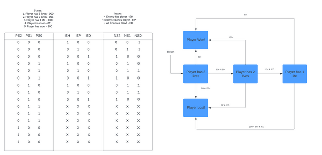
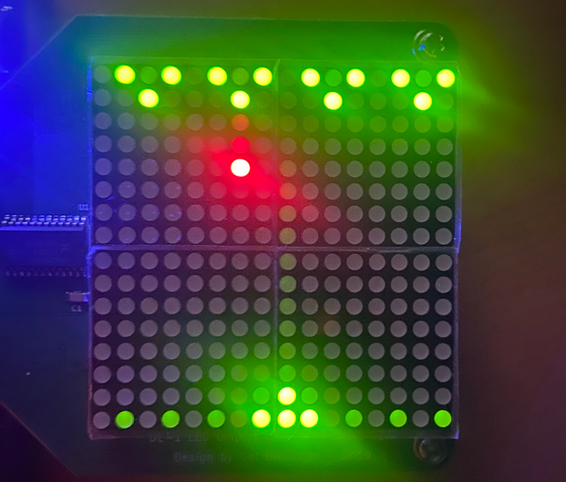
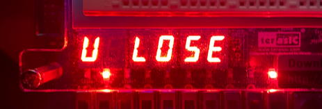
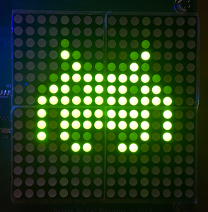
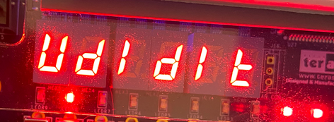
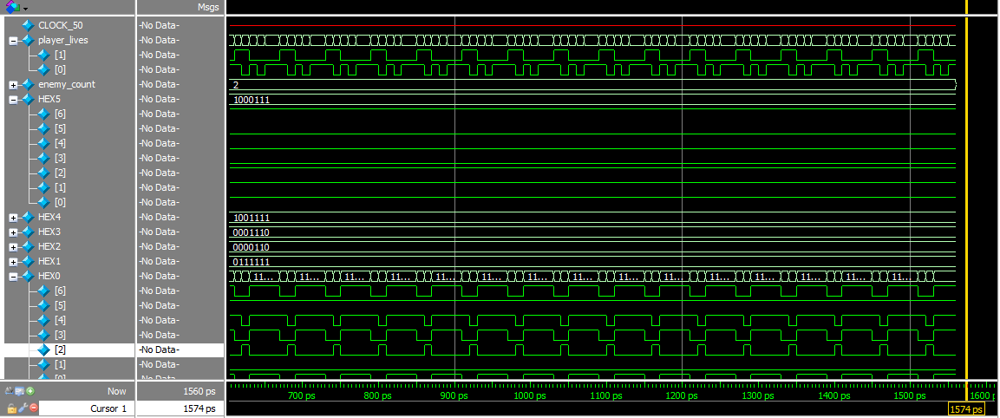
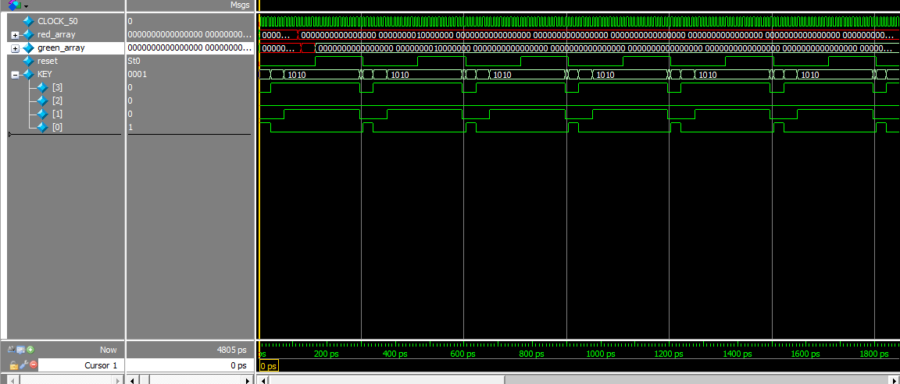

# Invaders of Space

## Introduction
For my final goal and lab for this class, I chose to incorporate a classic video game called, Space Invaders. Incorporating the game screen using a 16x16 LED screen in which would display the player occupying the bottom of the screen while 4 invaders start at the top and slowly descend towards the player. In addition, the aliens can shoot at the player. If the player is hit 3 times or the invaders make it to the position of the player, the player loses. In addition, the player can shoot back and destroy the invaders, if the player manages to destroy all four enemies, they win. In addition, the player could move using KEY[0] for the right, and KEY[3] for the left. Then, the player can shoot using KEY[1]. The number of lives is displayed on a 7-segment display and displays the number of lives the player has, starting with 3. Changes to “U LOSE” when the player loses, or “UdIdIt” when the player has won. In this project, I incorporated primarily Decoders and muxes for controlling the 16x16 LED display. The Decoder controls the rows of the LED and the muxes to control each column on the LED display.

## Methods
* Finite State Machine
Used for several applications. One in particular, checking the status of the game. If the player has more than or equal to one life and there are still enemies on the board, the game is in the state, “Ongoing”. If the player has no lives, the game stops and enters the state, “Lost”. If there are no enemies left and the player is still alive, the game stops and enters the state, “Won”. Other FSM’s are incorporated into the enemy movements based on positioning and blasting and player movement and its shooting.

* Multiplexers - MUX
MUXES are used for controlling each column on the 16x16 LED Display. Each column takes in 8 inputs to determine the green and red contrast value. That way a column on the LED display will show that 8 input value. 3-bit Select input is controlled by a 3-bit counter.

* Decoders
The Decoder is used for determining the lighting of the rows in the 16x16 LED display. Controlling each row for displaying the rows of which the player resides and where the enemies are and where they move to. It’s also for when an enemy or player has fired a projectile.

## Results
The main components composed of the FPGA board provided for us in addition to the 16x16 LED display. The LED display is controlled by multiple MUXes and one decoder. The Muxes are used for controlling the columns of the 16x16 LED Display, each column assigned its corresponding MUX. One decoder is used to controlling all of the rows of that display. The switches used for the MUXs and decoder, was a 3-bit counter to keep the clock ticking. Planned out the states of the game to check if it's ongoing and it went just as expected as well as showing controls of the player and the movement of the enemies. 

The LED display would show the default screen of four enemy shaped, “Invaders”, coming down towards the player. In addition, one enemy would fire a projectile at a time. The player occupies the bottom of the LED display and fires projectiles towards the enemy. The enemy movement and player movement as well. The LED display shows a red space invader dancing up and down signifying that the player lost. In addition, the 7 segment display on the board shows the text, “U LOSE”.

The LED displays a green space invader dancing up and down when the player has destroyed the four invaders coming towards them, works as expected. In addition to that, the 7 segment displays, “UdIdIt” (You did it) to signify that the player has won.  

During the game, which is the default display on the 7 segment display, is “LIFE - 3”, 3 representing the number of lives the player has. 

Once the game is over, simply switches, SW[9] to high will reset the game. Everything worked as expected and all checks of a working product were simulated using Modelsim. Essentially, how the 16x16 LED display would behave based on what was going on. 

## Discussions
In conclusion, this was the culmination of what I learned throughout the course. With the 16x16 LED display, I managed to get a mini version of this game to work as well as button components for controlling the player. Simulation displayed what was supposed to happen as well as the board showing the game in action. Everything worked as well as expected and everything worked as expected.

## Abbreviations
FPGA: Field Programmable Gate Arrays; LEDR: Light-Emitting Diode Register; SW: Switch; FSM: Finite State Machine; LFSR: Linear-feedback shift register; MUX: Multiplexer

## License
**Copyright &copy; 2023 Jordan Fraser. All rights reserved.**